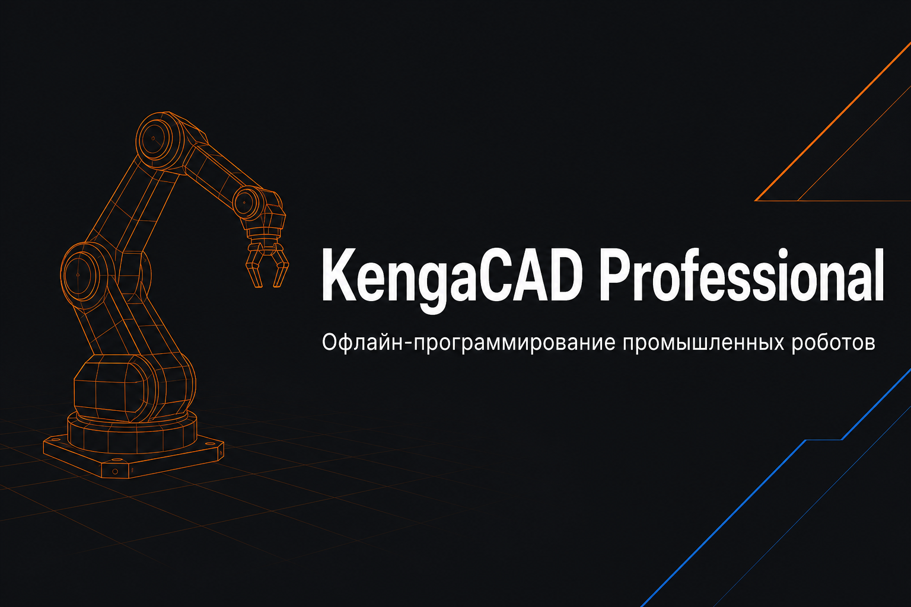

# KengaCAD Professional

[](https://github.com/GermannM3/KengaCad/releases/latest)
[](https://github.com/GermannM3/KengaCad/actions/workflows/ci.yml)
[](https://github.com/GermannM3/KengaCad/releases/latest)
[](https://github.com/GermannM3/KengaCad/releases/latest)
[](https://github.com/GermannM3/KengaCad/releases/latest)
[](https://dotnet.microsoft.com/)

**Офлайн-программирование промышленных роботов — 2D/3D-траектории, симуляция ячейки, экспорт KRL, RAPID, Fanuc TP, UR, Yaskawa, G-code.**



KengaCAD — программа для офлайн-программирования промышленных роботов. Рисуешь траекторию в 2D или 3D, задаёшь точки программы, смотришь симуляцию в ячейке, выгружаешь код под **KUKA**, **ABB**, **Fanuc**, **UR**, **Yaskawa** или G-code.

| Платформа | Версия | Что это |
|-----------|--------|---------|
| **Windows (WPF)** | основная | Полный CAD, 3D-симуляция, OPC UA, multi-robot |
| **Linux / macOS** | portable | PyQt-клиент (`_legacy`), те же конфиги и постпроцессоры |
| **Android (MAUI)** | companion | Jog, TCP, точки, экспорт KRL / RAPID / G-code |

> **Скачать:** [github.com/GermannM3/KengaCad/releases](https://github.com/GermannM3/KengaCad/releases/latest)

---

## Скачать

| Файл | Платформа | Описание |
|------|-----------|----------|
| `KengaCAD_Professional_*_Setup.exe` | Windows | Установщик, .NET ставить не нужно |
| `KengaCAD_Professional_*_win-x64.zip` | Windows | Portable: распаковал → `KengaCAD.exe` |
| `KengaCAD_Professional_*_linux-x64_portable.tar.gz` | Linux | PyQt-клиент, нужен Python 3 |
| `KengaCAD_Professional_*_linux-x64.AppImage` | Linux | Один файл (если собрался в CI) |
| `KengaCAD_Professional_*_macos_portable.tar.gz` | macOS | PyQt-клиент |
| `KengaCAD_Professional_*_android.apk` | Android | Jog + экспорт, не полный CAD |

Актуальная версия: **v2.2.1**. Новый релиз — тег `v*` → GitHub Actions собирает все артефакты автоматически.

---

## Windows — установка

1. Скачай **`Setup.exe`** с [Releases](https://github.com/GermannM3/KengaCad/releases/latest).
2. Запусти. SmartScreen на неподписанном exe — «Подробнее» → «Выполнить в любом случае», или возьми ZIP.
3. В меню Пуск появится **KengaCAD Professional**.
4. При первом запуске: лента сверху, 2D слева, 3D-робот справа, jog-пульт, журнал внизу.

**Минимум:** Windows 10/11 x64 · 4 ГБ RAM · видеокарта с 3D

---

## Windows — первые шаги

| Действие | Где |
|----------|-----|
| Выбор робота (KUKA, ABB, «Демо»…) | Вкладка **Робот** → «Загрузить» |
| Движение TCP | Jog-пульт справа, ползунки или X/Y/Z |
| Чертёж LINE, CIRCLE, POLYLINE | Вкладка **Главная**, клики на 2D-поле |
| Стол, конвейер, второй робот | Вкладка **Симуляция** |
| Точки P001, P002… | Jog → «Добавить текущую TCP» |
| MoveL / MoveJ, симуляция | Кнопки на jog-пульте → «Старт» |
| Экспорт KRL, RAPID, TP, UR… | **Файл** или лента |
| Сохранение проекта | `.kengacad`; DXF открывается и сохраняется |

Командная строка внизу: `LINE`, `CIRCLE`, `ZOOM`, `ESC` — отмена.

---

## Linux и macOS

Полноценный WPF-клиент только под Windows. На Linux и macOS — portable с PyQt из `_legacy`.

**Linux:**

```bash
tar xzf KengaCAD_Professional_2.2.1_linux-x64_portable.tar.gz
cd распакованная_папка
chmod +x install.sh run.sh && ./install.sh && ./run.sh
```

**macOS:**

```bash
tar xzf KengaCAD_Professional_2.2.1_macos_portable.tar.gz
chmod +x install.sh run.sh KengaCAD.command && ./install.sh && ./KengaCAD.command
```

---

## Android

APK в Releases: jog по осям, TCP, точки программы, экспорт через «Поделиться». Полный CAD и 3D — только desktop.

---

## Сборка из исходников

```powershell
git clone https://github.com/GermannM3/KengaCad.git
cd KengaCad
dotnet build KengaCAD.slnx -c Release
.\build_installer_professional.ps1   # Setup + ZIP
```

Android APK: `.\scripts\sync_mobile_config.ps1` → `dotnet publish KengaCAD.Mobile\ ... -f net9.0-android`

Подробнее: [`docs/BUILD.md`](docs/BUILD.md) · [`docs/RELEASE_CHECKLIST.md`](docs/RELEASE_CHECKLIST.md)

---

## Настройки

Папка `config/` рядом с exe:

| Файл | Назначение |
|------|------------|
| `robots.json` | Модели роботов, DH-параметры |
| `postprocessors.json` | Шаблоны постпроцессоров |
| `templates/*.sbn` | KRL, RAPID и др. |
| `settings.json` | Пути FreeCAD (STEP) и ODA (DWG) |

---

## OPC UA и I/O

Блок **Сигналы I/O** в левой панели · endpoint `opc.tcp://localhost:4840` · кнопка **OPC** · NodeId для PLC

---

## Структура репозитория

```
KengaCAD/           WPF desktop (Windows)
KengaCAD.Core/      Роботы, постпроцессоры (Scriban 7.x)
KengaCAD.Mobile/    MAUI Android
_legacy/            PyQt для Linux/macOS
installers/         Inno Setup, AppImage
docs/               Документация
```

---

## Проблемы

| Ситуация | Решение |
|----------|---------|
| Crash на Windows | `%LocalAppData%\KengaCAD\crash_log.txt` |
| Smart App Control | [`docs/WINDOWS_TRUST_AND_SIGNING.md`](docs/WINDOWS_TRUST_AND_SIGNING.md) |

---

## Лицензия

Проприетарное ПО · `LICENSE.txt` · KengaCAD Team, 2026
